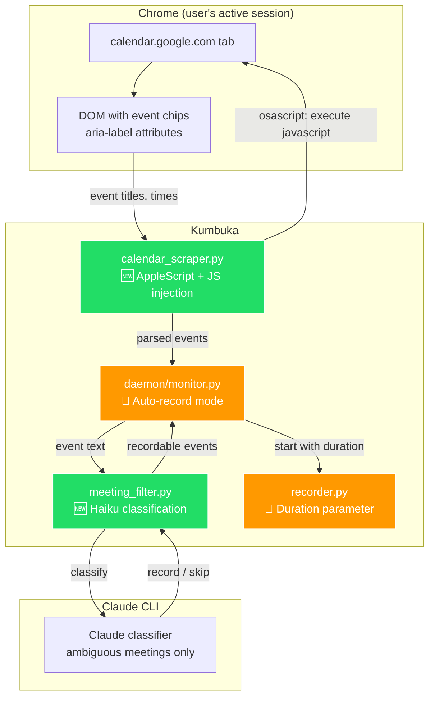

# AppleScript Calendar Scraping & Automatic Recording

## Overview

**Motivation:** Kumbuka's current Google Calendar integration requires a GCP project, OAuth credentials, and a multi-step auth flow. This is unnecessary friction — the user is already logged into Google Calendar in Chrome.

**Goals:**
1. **Replace OAuth with AppleScript JS execution in Chrome** — inject JavaScript into a dedicated authenticated `calendar.google.com` tab, scrape events from the DOM. Zero Google Cloud setup. No GCP project.
2. **Auto-record for meeting duration + buffer** — when the monitor detects a meeting, start a headless recording-only flow automatically and stop after `meeting_end + 10min`.
3. **Smart meeting filtering** — use deterministic rules first, then Claude classification for ambiguous meetings: skip personal time (busy, lunch, gym, focus hours, holidays, all-day events) but always record 1:1s and real meetings.
4. **Remove all OAuth artifacts** — delete Google OAuth code, dependencies, credentials files, and GCP-related documentation.

## Required Approvals

- [ ] User review of this design doc

## TL;DR

AppleScript executes JS in a dedicated authenticated Calendar tab → scrape events from DOM → deterministic rules + Claude classification decide recordable vs skip → daemon launches headless `record-only` for meeting duration + 10 minutes. No GCP project, no Google OAuth, no extra SDK.

## System Design Diagram



**Legend:** 🟢 New  🟠 Modified  🔴 Deleted

## System Context

Verified via testing on 2026-03-20:
- AppleScript `execute javascript` in Chrome tabs works from Python via `subprocess` + `osascript`
- Google Calendar DOM exposes events via `[data-eventchip]` elements with `aria-label` attributes containing event title, time, date, participants
- Aria-labels are accessibility features — the most stable part of the DOM across Calendar updates
- Requires "Allow JavaScript from Apple Events" enabled in Chrome (View → Developer)
- LaunchAgent environments are PATH-constrained, so daemon subprocesses must use absolute executables or `sys.executable`

Approaches tested and rejected:
- Cookie + SAPISIDHASH: Google validates browser context server-side
- Playwright + injected cookies: cookies are browser-bound
- CDP remote debugging: Chrome blocks CDP on default profile
- Secret iCal URL: disabled by Workspace admin

## Directory Structure

```
kumbuka/
├── kumbuka/
│   ├── __main__.py              # 🔄 Add record-only command, remove OAuth CLI commands
│   ├── config.py                # 🔄 Add KUMBUKA_AUTO_RECORD, KUMBUKA_BUFFER_MINUTES
│   │                            #     Remove CREDENTIALS_FILE, TOKEN_FILE refs
│   ├── recorder.py              # 🔄 Add duration_secs param to record()
│   ├── calendar_scraper.py      # 🆕 AppleScript-based Calendar event extraction
│   ├── meeting_filter.py        # 🆕 Haiku-based meeting classification
│   ├── runtime.py               # 🆕 Shared executable discovery helpers
│   ├── calendar.py              # 🔴 DELETE (OAuth-based, replaced by calendar_scraper.py)
│   └── daemon/
│       ├── monitor.py           # 🔄 Auto-record with calculated duration
│       └── com.kumbuka.monitor.plist  # 🔄 Remove OAuth env vars
├── pyproject.toml               # 🔄 Remove google-auth*, google-api-python-client
└── README.md                    # 🔄 Rewrite calendar section
```

## Implementation Details

### 1. Calendar Scraper (`calendar_scraper.py`)

Single module that replaces the entire OAuth calendar stack. Uses `subprocess` + `osascript` to execute JS in Chrome.

**Core functions:**

```python
def ensure_kumbuka_calendar_tab() -> CalendarTabRef | None:
    """Find or create Kumbuka's dedicated calendar tab in Chrome."""
    # 1. Check if Chrome is running
    # 2. Reuse tracked tab/window IDs if they still exist
    # 3. Otherwise create a dedicated background window/tab at
    #    calendar.google.com/calendar/u/0/r/custom/2/d
    # 4. Wait for page load and persist tab/window IDs
    # Returns None if Chrome is not running

def get_upcoming_events(minutes_ahead: int = 5) -> list[CalendarEvent]:
    """Scrape upcoming events from Google Calendar in Chrome."""
    # 1. ensure_kumbuka_calendar_tab()
    # 2. Ensure the dedicated tab is on 2-day schedule view (custom/2/d)
    # 3. Execute JS to extract all [data-eventchip] aria-labels
    # 4. Parse aria-labels into CalendarEvent objects
    # 5. Filter to events starting within minutes_ahead

def get_current_meetings() -> list[CalendarEvent]:
    """Get meetings currently in progress."""
    # Same extraction, filter to events where start <= now <= end

def is_authenticated() -> bool:
    """Check if Chrome has an authenticated Calendar tab."""
    # Read title + location from the dedicated tab.
    # If redirected to accounts.google.com or title contains "Sign in",
    # treat as unauthenticated.
```

**Aria-label parsing:**

Event chips have aria-labels like:
- `"10:00 AM to 10:30 AM, Weekly Standup, John Smith, Google Meet, Room 101, March 20, 2026"`
- `"Company Focus Week, All day, Dami Dare, March 16 – 20, 2026"`
- `"12am to 11:30pm, Global Company Holiday, March 20, 2026"`

Parser extracts: time range, title, date, participant tokens, and all-day state.

`CalendarEvent` should preserve the existing fields consumed elsewhere and extend them with the fields the classifier actually needs:

```python
@dataclass(frozen=True)
class CalendarEvent:
    id: str  # stable hash of title/start/end/participants
    title: str
    start: datetime
    end: datetime
    calendar_name: str
    participants: tuple[str, ...]
    is_all_day: bool
    raw_label: str
```

`id` must be generated from scraped content, not borrowed from Google API assumptions.

**Tab ownership:** The monitor must never hijack the user's active Calendar tab. Kumbuka owns a dedicated background Calendar tab/window and only navigates that managed tab.

**One-time setup:** User enables "Allow JavaScript from Apple Events" in Chrome → View → Developer → Allow JavaScript from Apple Events. `kumbuka calendar setup` validates this by running a no-op script against the dedicated tab and opening Calendar if needed.

### 2. Meeting Filter (`meeting_filter.py`)

Uses deterministic rules first and Claude classification only for ambiguous events.

```python
def should_record(event: CalendarEvent) -> bool:
    """Decide if this meeting should be recorded."""
```

**Pre-filter (no Haiku needed):**
- All-day events → skip
- Titles matching strong skip patterns (`lunch`, `gym`, `focus`, `holiday`, `OOO`, `do not disturb`) → skip
- Titles matching strong record patterns (`1:1`, `sync`, `standup`, `interview`, `review`) → record
- Events with participant evidence → record

**Claude classification path:**
- Reuse the existing Claude CLI integration already required by Kumbuka
- Do not add the `anthropic` Python SDK
- Only invoke Claude when deterministic rules do not produce a confident result
- Default to `RECORD` on classifier failure

**Classification prompt:**
```
Given this calendar event, should it be recorded as a meeting?

Event: "{title}"
Time: {start} - {end}
All-day: {yes/no}
Participants: {participants}

Rules:
- RECORD: 1:1s, team meetings, standups, syncs, reviews, interviews, any meeting with other people
- SKIP: personal time, busy blocks, lunch, gym, focus hours, holidays, "Do not disturb", travel time
- When in doubt, RECORD

Respond with exactly: RECORD or SKIP
```

**Caching:** Store classification results in a separate `meeting_classification_cache.json`. Do not reuse `prompted_meetings.json`; that file remains responsible only for 24-hour monitor dedupe.

### 3. Duration-Based Recording (`recorder.py`)

Add `duration_secs` parameter to `record()`:

```python
def record(duration_secs: int | None = None) -> tuple[bytes | None, str | None]:
```

When set:
- Auto-set `_stop_event` after `duration_secs` elapsed
- Display countdown: `🔴 Recording: 23:45 remaining` instead of open-ended timer
- Ctrl+C still works as early-stop override
- `MAX_DURATION` still enforced as safety ceiling

### 4. Auto-Record Monitor (`daemon/monitor.py`)

Replace dialog-based flow with fully automatic recording.

```python
def start_auto_recording(event: CalendarEvent):
    """Start headless recording for meeting duration + buffer."""
    now = datetime.now(timezone.utc)
    remaining = (event.end - now).total_seconds()
    buffer = BUFFER_MINUTES * 60
    duration = max(int(remaining + buffer), 300)  # minimum 5 min

    subprocess.Popen(
        [find_python(), "-m", "kumbuka", "record-only", "--duration", str(duration)],
        stdout=open(OUTPUT_DIR / "auto_record.log", "a"),
        stderr=subprocess.STDOUT,
    )

def check_calendar():
    """Check calendar and auto-record if meeting found."""
    from kumbuka.calendar_scraper import get_upcoming_events, get_current_meetings
    from kumbuka.meeting_filter import should_record

    events = get_upcoming_events(PROMPT_MINUTES) + get_current_meetings()

    for event in events:
        if event.id in prompted:
            continue
        if not should_record(event):
            log(f"Skipping: {event.title}")
            continue

        prompted.add(event.id)
        save_prompted(prompted)
        log(f"Auto-recording: {event.title}")
        start_auto_recording(event)
        return True
```

**Config additions:**
- `KUMBUKA_AUTO_RECORD` — default `true` (headless auto-record)
- `KUMBUKA_BUFFER_MINUTES` — default `10`

**Headless boundary:** Auto-recording must stop at saved WAV output. The daemon-launched flow must not immediately continue into transcript processing and Claude note generation. That remains an explicit user-triggered follow-up or a separate future automation task.

### 5. CLI Changes (`__main__.py`)

**Add:**
```
kumbuka record-only --duration 3600  # Record for exactly 1 hour, then exit
kumbuka calendar setup       # Check Chrome JS permissions, open Calendar
kumbuka calendar test        # Show upcoming events (via scraper)
```

**Remove:**
```
kumbuka calendar auth        # GONE (no OAuth)
kumbuka calendar list        # GONE (no API access to list calendars)
```

### 6. Dependency Changes (`pyproject.toml`)

**Remove:**
- `google-api-python-client>=2.0.0`
- `google-auth-oauthlib>=1.0.0`

### 7. Files to Delete

- `kumbuka/calendar.py` — entire file (OAuth-based calendar integration)
- `~/.kumbuka/credentials.json` — OAuth client credentials (user's machine)
- `~/.kumbuka/token.json` — OAuth refresh token (user's machine)
- References to `CREDENTIALS_FILE`, `TOKEN_FILE`, `SCOPES` in all files

## Task Graph

### Task 1: Calendar Scraper

**ID:** `task-1`
**Depends on:** None
**Parallel group:** `core-modules`
**Estimated files:** 1
**Affected paths:** `kumbuka/calendar_scraper.py`

**Acceptance criteria:**

- [ ] `ensure_kumbuka_calendar_tab()` finds or opens `calendar.google.com` in Chrome via AppleScript
- [ ] Scraper manages a dedicated Kumbuka Calendar tab/window and never navigates the user's active tab
- [ ] `get_upcoming_events(minutes_ahead)` returns `list[CalendarEvent]` by scraping DOM
- [ ] `get_current_meetings()` returns currently-in-progress meetings
- [ ] Aria-label parser handles: timed events, all-day events, multi-day events
- [ ] `is_authenticated()` detects sign-in redirect
- [ ] `CalendarEvent` preserves existing fields and extends them with `participants`, `is_all_day`, and `raw_label`
- [ ] Graceful failure when Chrome is not running

---

### Task 2: Meeting Filter

**ID:** `task-2`
**Depends on:** None
**Parallel group:** `core-modules`
**Estimated files:** 1
**Affected paths:** `kumbuka/meeting_filter.py`

**Acceptance criteria:**

- [ ] `should_record(event)` returns `bool` using Claude classification for ambiguous events
- [ ] Pre-filter: all-day events → skip without calling Claude
- [ ] Strong deterministic rules handle obvious record/skip cases before Claude is invoked
- [ ] Always records 1:1s and meetings with other participants
- [ ] Skips: personal time, busy blocks, lunch, gym, focus hours, holidays
- [ ] Results cached in `meeting_classification_cache.json`
- [ ] Graceful fallback: if Claude classification is unavailable, default to RECORD

---

### Task 3: Duration-Based Recording

**ID:** `task-3`
**Depends on:** None
**Parallel group:** `core-modules`
**Estimated files:** 1
**Affected paths:** `kumbuka/recorder.py`

**Acceptance criteria:**

- [ ] `record()` accepts optional `duration_secs: int | None` parameter
- [ ] When set, recording auto-stops after that many seconds
- [ ] Ctrl+C still works as early-stop override
- [ ] Countdown displayed: `🔴 Recording: MM:SS remaining`
- [ ] `MAX_DURATION` safety ceiling still enforced

---

### Task 4: Auto-Record Monitor + Config

**ID:** `task-4`
**Depends on:** `task-1`, `task-2`, `task-3`
**Parallel group:** None
**Estimated files:** 4
**Affected paths:** `kumbuka/daemon/monitor.py`, `kumbuka/config.py`, `kumbuka/daemon/com.kumbuka.monitor.plist`, `kumbuka/runtime.py`

**Acceptance criteria:**

- [ ] `KUMBUKA_AUTO_RECORD` config (default `true`)
- [ ] `KUMBUKA_BUFFER_MINUTES` config (default `10`)
- [ ] Monitor uses `calendar_scraper` instead of `calendar` module
- [ ] Monitor uses `meeting_filter.should_record()` to classify events
- [ ] Auto-record starts headless absolute-path `python -m kumbuka record-only --duration <calculated>` subprocess
- [ ] No dialog shown in auto-record mode
- [ ] LaunchAgent plist updated: remove OAuth-related env vars and keep only values required by monitor/recording
- [ ] Daemon-launched auto-record flow exits after writing audio and does not immediately start transcript/Claude processing

---

### Task 5: CLI + Delete OAuth Artifacts

**ID:** `task-5`
**Depends on:** `task-1`
**Parallel group:** None
**Estimated files:** 4
**Affected paths:** `kumbuka/__main__.py`, `kumbuka/runtime.py`, `kumbuka/calendar.py`, `pyproject.toml`

**Acceptance criteria:**

- [ ] `kumbuka record-only --duration SECONDS` command works
- [ ] `kumbuka calendar setup` checks Chrome JS permissions and opens Calendar
- [ ] `kumbuka calendar test` uses `calendar_scraper` to show events
- [ ] `kumbuka calendar auth` removed
- [ ] `kumbuka calendar list` removed
- [ ] `kumbuka/calendar.py` deleted
- [ ] `google-api-python-client`, `google-auth-oauthlib` removed from `pyproject.toml`
- [ ] All references to `credentials.json`, `token.json`, OAuth flow removed from code
- [ ] `monitor_enable()` no longer checks for OAuth credentials

---

### Task 6: README Update

**ID:** `task-6`
**Depends on:** `task-4`, `task-5`
**Parallel group:** None
**Estimated files:** 2
**Affected paths:** `README.md`, `kumbuka.env.example`

**Acceptance criteria:**

- [ ] "Google Cloud Setup" section replaced with "Prerequisites: Chrome with Google Calendar"
- [ ] New setup: `kumbuka calendar setup` (one command)
- [ ] Auto-record flow documented with meeting filter behavior
- [ ] `record-only --duration` command documented
- [ ] New config vars documented (`KUMBUKA_AUTO_RECORD`, `KUMBUKA_BUFFER_MINUTES`)
- [ ] All OAuth/GCP references removed from README
- [ ] Troubleshooting updated: "Chrome not running" instead of "credentials.json not found"
